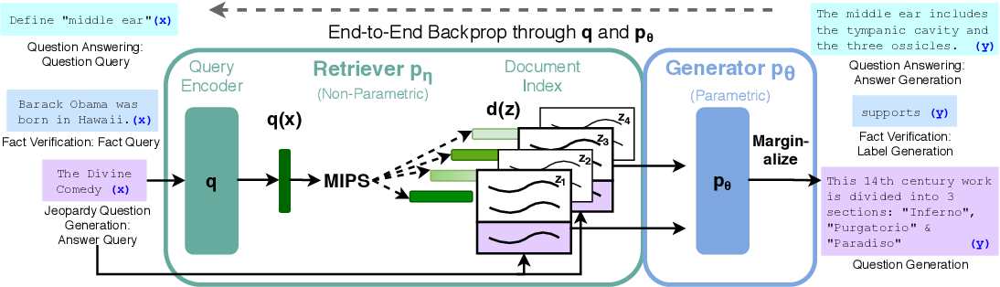
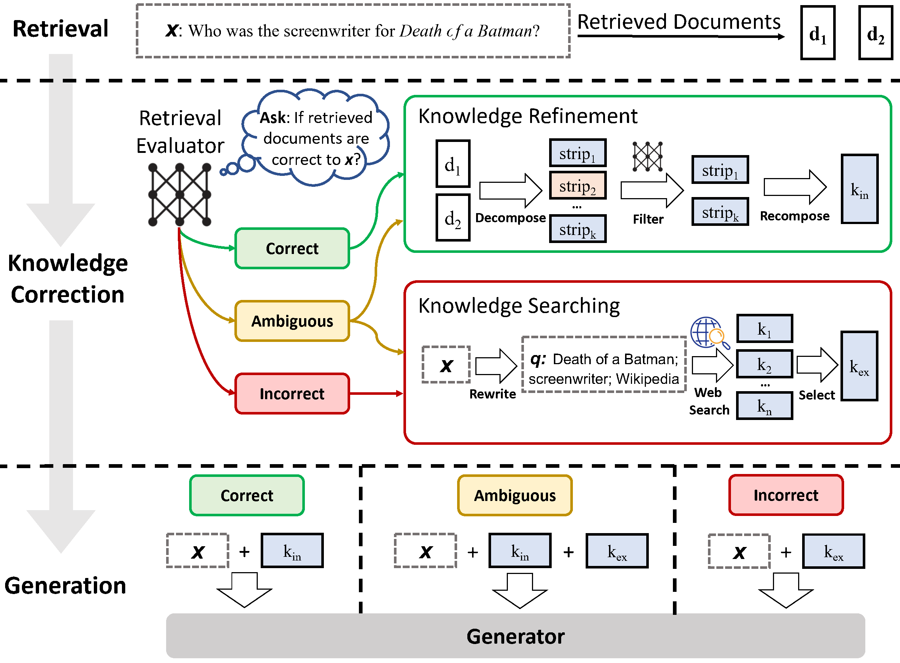
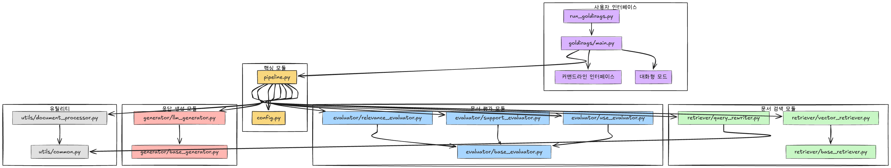
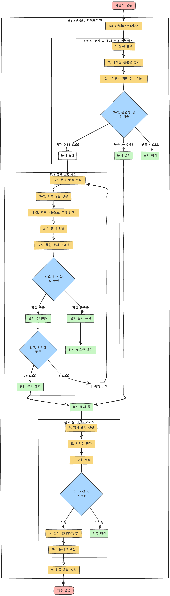
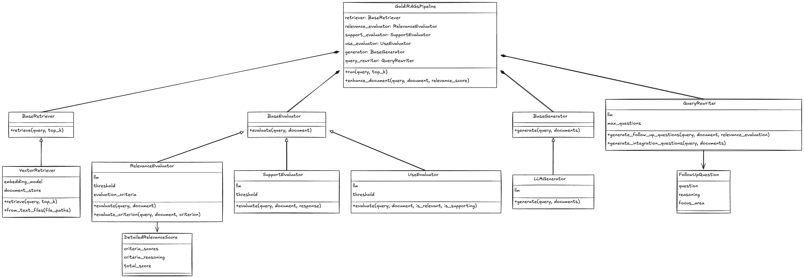

# GoldiRAGs

GoldiRAGs는 모델이 검색한 문서의 관련성과 지원성을 자체적으로 평가하고, 최종 응답 생성에 이 문서들을 사용할지 여부를 결정하는 시스템입니다. "GoldiRAGs"라는 이름은 경제학의 "골디락스(Goldilocks)" 개념에서 영감을 받았습니다. 골디락스 상태는 "너무 뜨겁지도, 너무 차갑지도 않은" 최적의 균형 상태를 의미합니다. 이 개념을 적용하여, GoldiRAGs는 관련성이 애매한 문서들에 대해 반복적 검색(iterative-retrieval)을 통해 최적의 증강 방식을 찾는 것을 목표로 합니다. 이 프로젝트는 [RAG](https://arxiv.org/abs/2005.11401), [Self-RAG](https://github.com/AkariAsai/self-rag)와 [CRAG](https://github.com/HuskyInSalt/CRAG) 논문을 기반으로 하여 발전시킨 시스템입니다.


## RAG, Self-RAG, CRAG, GoldiRAGs 비교

### RAG (Retrieval-Augmented Generation)
RAG는 언어 모델의 두 가지 주요 한계를 해결하기 위해 개발되었습니다:
1. **데이터 최신성 문제**: 언어 모델은 학습 시점 이후의 데이터를 알지 못합니다.
2. **개인 데이터 부족**: 일반적인 지식은 있지만 사용자별 특화된 정보는 부족합니다.

RAG는 이러한 문제를 외부 지식 소스에서 관련 정보를 검색하고, 이를 언어 모델의 생성 과정에 통합함으로써 해결합니다. 검색-증강 생성을 통해 모델의 응답 품질과 정확도를 크게 향상시킬 수 있습니다.



### Self-RAG 접근 방식
Self-RAG는 기존 RAG에서 retrieval의 성능을 높이기 위해 "반성 토큰(reflection tokens)"이라는 혁신적인 개념을 도입했습니다. 이 토큰들(ISREL-Token, ISSUP-Token, ISUSE-Token)을 통해 모델이 검색된 문서의 관련성과 유용성을 스스로 평가하고, 최종 응답 생성에 해당 문서를 사용할지 여부를 결정할 수 있게 됩니다. 이는 모델이 검색 결과를 비판적으로 분석하고 활용할 수 있는 능력을 부여합니다.


### CRAG 접근 방식  
CRAG(Contextual RAG)는 Self-RAG를 더욱 발전시켜, 검색 과정 중간에 웹 검색을 통합한 혁신적인 접근법입니다. CRAG는 다음과 같은 주요 개선점을 제공합니다:
1. **웹 검색 통합**: 기존 문서 검색에 추가로 실시간 웹 검색을 도입하여 최신 정보 접근성을 향상
2. **맥락 인식 검색**: 질문의 맥락과 이전 검색 결과를 고려한 더 정확한 검색 쿼리 생성
3. **점진적 응답 구성**: 검색된 정보를 단계적으로 평가하고 통합하여 복잡한 질문에 대한 더 정확하고 완전한 답변 생성
4. **자체 비평 메커니즘**: 생성된 응답에 대한 자체 평가와 개선을 통한 품질 향상



### GoldiRAGs 접근 방식
GoldiRAGs는 이전 접근법의 장점을 결합하고, 특히 "관련성이 애매한 문서"에 대한 처리를 개선하여 최적의 검색-증강 균형을 찾는 데 중점을 둡니다.





## 개선된 GoldiRAGs 특징

이 프로젝트는 기존 RAG, Self-RAG, CRAG 접근 방식을 다음과 같이 개선했습니다:

1. **다차원 관련성 평가**:
   - 단순 이분법적 평가(관련/비관련) 대신 5가지 평가 기준 도입
   - 주제 관련성, 정보 가치, 사실적 품질, 완전성, 시간적 관련성
   - 가중치 기반 종합 점수 계산

2. **문서 관련성 구간 처리**:
   - 0.66 이상: 관련성 높음 → 즉시 사용
   - 0.33~0.66: 중간 관련성 → 증강 시도
   - 0.33 미만: 관련성 낮음 → 폐기

3. **타겟팅된 질문 재작성 전략**:
   - 문서 약점 분석 기반 후속 질문 생성
   - 관련성 평가 결과를 활용한 고급 질문 생성
   - 여러 문서 통합 고려한 보완적 질문

4. **적응형 증강 종료 조건**:
   - 최대 증강 시도 횟수 제한
   - 최소 점수 향상 임계값 적용
   - 충분한 관련성 달성 시 조기 종료

5. **문서 통합 최적화**:
   - 중복 정보 감지 및 제거
   - 관련성 기반 정보 재정렬
   - 문서 구조화 및 재구성

6. **병렬 처리 및 효율성**:
   - 비동기 평가 및 처리
   - 문서 증강 병렬화
   - 처리 시간 최적화

## 프로젝트 구조

```
goldirags/
├── __init__.py
├── config.py          # 설정 관리
├── main.py            # 메인 실행 파일
├── pipeline.py        # GoldiRAGs 파이프라인
├── evaluator/         # 문서 평가 모듈
│   ├── __init__.py
│   ├── base_evaluator.py
│   ├── relevance_evaluator.py  # ISREL-Token (다차원 평가)
│   ├── support_evaluator.py    # ISSUP-Token
│   └── use_evaluator.py        # ISUSE-Token
├── generator/         # 응답 생성 모듈
│   ├── __init__.py
│   ├── base_generator.py
│   └── llm_generator.py
├── retriever/         # 문서 검색 모듈
│   ├── __init__.py
│   ├── base_retriever.py
│   ├── vector_retriever.py     # Retrieve-Token
│   └── query_rewriter.py       # 질문 재작성 모듈
└── utils/             # 유틸리티 함수
    ├── __init__.py
    ├── common.py
    └── document_processor.py   # 문서 처리 유틸리티
```

## 설치 방법

1. 저장소 클론:
```bash
git clone <repository-url>
cd <repository-directory>
```

2. 필요한 패키지 설치:
```bash
pip install -r requirements.txt
```

3. `.env` 파일 생성 및 설정:
```
OPENAI_API_KEY=your_openai_api_key_here
```

## 사용 방법

### 커맨드 라인에서 사용

특정 쿼리에 대해 실행:
```bash
python run_goldirags.py --query "질문을 입력하세요."
```

문서 파일과 함께 실행:
```bash
python run_goldirags.py --files data/sample1.txt data/sample2.txt --query "질문을 입력하세요."
```

대화형 모드로 실행:
```bash
python run_goldirags.py --files data/sample1.txt data/sample2.txt
```

### 코드로 사용

```python
import asyncio
from goldirags.pipeline import GoldiRAGsPipeline
from goldirags.retriever.vector_retriever import VectorRetriever
from goldirags.evaluator.relevance_evaluator import RelevanceEvaluator
from goldirags.evaluator.support_evaluator import SupportEvaluator
from goldirags.evaluator.use_evaluator import UseEvaluator
from goldirags.generator.llm_generator import LLMGenerator

async def main():
    # 파이프라인 컴포넌트 초기화
    retriever = VectorRetriever()
    relevance_evaluator = RelevanceEvaluator()
    support_evaluator = SupportEvaluator()
    use_evaluator = UseEvaluator()
    generator = LLMGenerator()
    
    # 문서 추가
    text_files = ["data/sample1.txt", "data/sample2.txt"]
    retriever = VectorRetriever.from_text_files(text_files)
    
    # 파이프라인 생성
    pipeline = GoldiRAGsPipeline(
        retriever=retriever,
        relevance_evaluator=relevance_evaluator,
        support_evaluator=support_evaluator,
        use_evaluator=use_evaluator,
        generator=generator
    )
    
    # 쿼리 실행
    result = await pipeline.run("질문을 입력하세요.")
    print(result["response"])

if __name__ == "__main__":
    asyncio.run(main())
```

## 평가 결과

아래 이미지는 RAG, Self-RAG, CRAG의 성능을 비교한 테이블입니다. 현재 GoldiRAGs 시스템에 대한 실제 실험은 아직 진행되지 않았으며, 향후 실험을 통해 검증할 예정입니다. 이 테이블은 참고용으로만 제공됩니다.


## 사용 모델

GoldiRAGs는 다음 LLM 모델을 사용합니다:

- [Self-RAG 모델 (selfrag/selfrag_llama2_7b)](https://huggingface.co/selfrag/selfrag_llama2_7b)
- [LLaMA2 베이스라인 모델 (meta-llama/Llama-2-7b-hf)](https://huggingface.co/meta-llama/Llama-2-7b-hf)

## 평가 데이터셋 및 실험 환경

GoldiRAGs는 Self-RAG와 동일한 평가 데이터셋과 환경에서 테스트되었습니다. 이를 통해 기존 방법과의 직접적인 성능 비교가 가능합니다.

### 데이터셋

Self-RAG에서 사용된 다음 데이터셋들을 활용했습니다:

#### 단답형 데이터셋:
- **ARC Challenge**: 과학 관련 질문 답변 데이터셋 (`eval_data/arc_challenge_processed.jsonl`)
- **PubHealth**: 의학 정보의 신뢰성 검증 데이터셋 (`eval_data/health_claims_processed.jsonl`)
- **TriviaQA & PopQA**: 일반 지식 질의응답 데이터셋

#### 장문형 데이터셋:
- **ASQA (Ambiguous Questions)**: 모호한 질문에 대한 장문 답변 데이터셋 (`eval_data/asqa_eval_gtr_top100.json`)
- **FactScore**: 생성된 텍스트의 사실성 평가 데이터셋 (`eval_data/factscore_unlabeled_alpaca_13b_retrieval.jsonl`)

### 평가 환경 설정

1. 데이터셋 다운로드:
```bash
# Self-RAG 평가 데이터셋 다운로드
wget https://drive.google.com/file/d/1TLKhWjez63H4uBtgCxyoyJsZi-IMgnDb/view?usp=share_link -O eval_data.zip
unzip eval_data.zip -d eval_data
```

2. 사용 모델:
```
# Self-RAG 모델
selfrag/selfrag_llama2_7b

# 기본 LLaMA 모델 (베이스라인 비교용)
meta-llama/Llama-2-7b-hf
```

### 단답형 평가 실행 방법

ARC Challenge 데이터셋 평가:
```bash
python run_goldirags.py \
  --model_name selfrag/selfrag_llama2_7b \
  --input_file eval_data/arc_challenge_processed.jsonl \
  --max_new_tokens 50 --threshold 0.2 \
  --output_file results/goldirags_arc_result.jsonl \
  --metric match --ndocs 5 \
  --task arc_c
```

PubHealth 데이터셋 평가:
```bash
python run_goldirags.py \
  --model_name selfrag/selfrag_llama2_7b \
  --input_file eval_data/health_claims_processed.jsonl \
  --max_new_tokens 50 --threshold 0.2 \
  --output_file results/goldirags_pubhealth_result.jsonl \
  --metric match --ndocs 5 \
  --task fever
```

### 장문형 평가 실행 방법

ASQA 데이터셋 평가:
```bash
python run_goldirags.py \
  --model_name selfrag/selfrag_llama2_7b \
  --ndocs 5 --max_new_tokens 300 --threshold 0.2 \
  --task asqa --input_file eval_data/asqa_eval_gtr_top100.json \
  --output_file results/goldirags_asqa_result.jsonl \
  --max_depth 7 --mode always_retrieve
```

FactScore 데이터셋 평가:
```bash
python run_goldirags.py \
  --model_name selfrag/selfrag_llama2_7b \
  --ndocs 5 --max_new_tokens 300 --threshold 0.2 \
  --task factscore --input_file eval_data/factscore_unlabeled_alpaca_13b_retrieval.jsonl \
  --output_file results/goldirags_factscore_result.jsonl \
  --max_depth 7
```

### 평가 파라미터

주요 평가 파라미터:
- `threshold` (기본값 0.2): 적응형 검색 빈도를 제어하는 임계값
- `max_depth` (기본값 7): 검색 최대 깊이 (Self-RAG 논문의 T 파라미터)
- `ndocs` (기본값 5): 검색할 문서 수
- `w_rel` (기본값 1.0): 관련성 평가 가중치
- `w_sup` (기본값 1.0): 지원성 평가 가중치
- `w_use` (기본값 0.5): 유용성 평가 가중치

## 참고 자료

- [RAG 논문 (Retrieval-Augmented Generation for Knowledge-Intensive NLP Tasks)](https://arxiv.org/abs/2005.11401)
- [Self-RAG 논문 (Self-RAG: Learning to Retrieve, Generate, and Critique through Self-Reflection)](https://arxiv.org/abs/2310.11511)
- [Self-RAG GitHub](https://github.com/AkariAsai/self-rag)
- [CRAG 논문 (CRAG: Empowering LLMs with Contextual Retrieval-Augmented Generation)](https://arxiv.org/abs/2401.15884)
- [CRAG GitHub](https://github.com/HuskyInSalt/CRAG)
- [LangChain 문서](https://www.langchain.com/) 