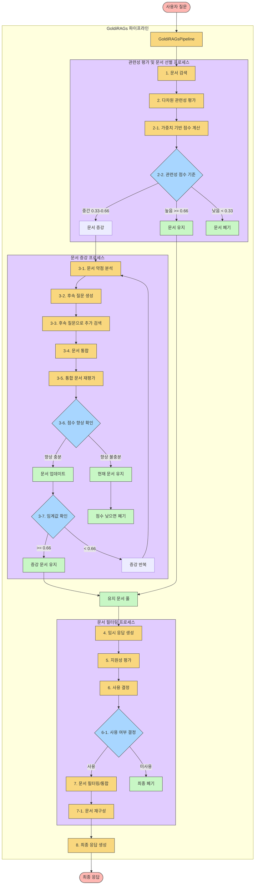

```mermaid
flowchart TD
    Start([사용자 질문]) --> Pipeline[GoldiRAGsPipeline]
    
    subgraph main[GoldiRAGs 파이프라인]
        Pipeline --> Retrieve[1. 문서 검색]
        
        subgraph process1[관련성 평가 및 문서 선별 프로세스]
            Retrieve --> Evaluate[2. 다차원 관련성 평가]
            
            Evaluate --> ScoreCalc[2-1. 가중치 기반 점수 계산]
            
            ScoreCalc --> DecisionRel{2-2. 관련성 점수 기준}
            DecisionRel -->|높음 >= 0.66| Keep[문서 유지]
            DecisionRel -->|중간 0.33-0.66| Enhance[문서 증강]
            DecisionRel -->|낮음 < 0.33| Discard[문서 폐기]
        end
        
        subgraph process2[문서 증강 프로세스]
            Enhance --> QueryAnalysis[3-1. 문서 약점 분석]
            
            QueryAnalysis --> QueryRewrite[3-2. 후속 질문 생성]
            
            QueryRewrite --> Retrieve2[3-3. 후속 질문으로 추가 검색]
            
            Retrieve2 --> MergeDoc[3-4. 문서 통합]
            
            MergeDoc --> Evaluate2[3-5. 통합 문서 재평가]
            
            Evaluate2 --> ImprovementCheck{3-6. 점수 향상 확인}
            ImprovementCheck -->|향상 불충분| CurrentDoc[현재 문서 유지]
            ImprovementCheck -->|향상 충분| UpdateDoc[문서 업데이트]
            
            UpdateDoc --> ThresholdCheck{3-7. 임계값 확인}
            ThresholdCheck -->|>= 0.66| KeepEnhanced[증강 문서 유지]
            ThresholdCheck -->|< 0.66| RepeatEnhance[증강 반복]
            
            RepeatEnhance --> QueryAnalysis
            CurrentDoc --> DiscardIfLow[점수 낮으면 폐기]
        end
        
        KeepEnhanced --> DocPool[유지 문서 풀]
        Keep --> DocPool
        
        DocPool --> TempResponse[4. 임시 응답 생성]
        
        subgraph process3[문서 필터링 프로세스]
            TempResponse --> SupportEval[5. 지원성 평가]
            
            SupportEval --> UseEval[6. 사용 결정]
            
            UseEval --> DecisionUse{6-1. 사용 여부 결정}
            DecisionUse -->|사용| FilterDocs[7. 문서 필터링/통합]
            DecisionUse -->|미사용| DiscardFinal[최종 폐기]
            
            FilterDocs --> RestructureDocs[7-1. 문서 재구성]
        end
        
        RestructureDocs --> FinalResponse[8. 최종 응답 생성]
    end
    
    FinalResponse --> End([최종 응답])
    
    classDef process fill:#f9d77e,stroke:#333,stroke-width:1px
    classDef decision fill:#a8d6ff,stroke:#333,stroke-width:1px
    classDef docProcess fill:#c8f7c5,stroke:#333,stroke-width:1px
    classDef endpoint fill:#ffb7b2,stroke:#333,stroke-width:1px
    classDef subProcess fill:#e1ccff,stroke:#333,stroke-width:1px
    
    class Pipeline,Retrieve,Evaluate,ScoreCalc,QueryAnalysis,QueryRewrite,Retrieve2,MergeDoc,Evaluate2,TempResponse,SupportEval,UseEval,FilterDocs,RestructureDocs,FinalResponse process
    class DecisionRel,ImprovementCheck,ThresholdCheck,DecisionUse decision
    class Keep,Discard,KeepEnhanced,CurrentDoc,UpdateDoc,DiscardIfLow,DiscardFinal,DocPool docProcess
    class Start,End endpoint
    class process1,process2,process3 subProcess
``` 